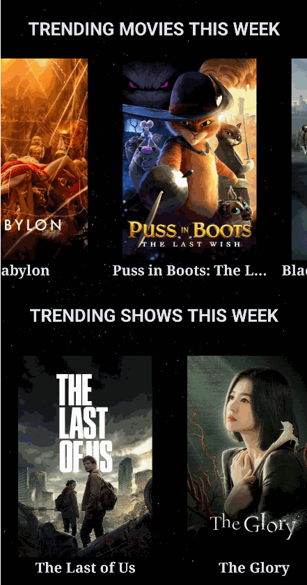

# Android Project 4 - *FLIXSTER TRENDING*

Submitted by: **Mi Nguyen**

**Flixster Trending** is a movie browsing app that allows users to browse trending movies and shows this week.

Time spent: **10** hours spent in total

## Required Features

The following **required** functionality is completed:

- [0] **Choose any endpoint on The MovieDB API except `now_playing`**
  - Chosen Endpoint: `[https://developers.themoviedb.org/3/trending/get-trending]`
- [0] **Make a request to your chosen endpoint and implement a RecyclerView to display all entries**
- [0] **Use Glide to load and display at least one image per entry**
- [0] **Click on an entry to view specific details about that entry using Intents**

The following **optional** features are implemented:

- [0] **Add another API call and RecyclerView that lets the user interact with different data.** 
- [xx] **Add rounded corners to the images using the Glide transformations**
- [0] **Implement a shared element transition when user clicks into the details of a movie**

## Video Walkthrough

Here's a walkthrough of implemented user stories:

## Notes

Google Secrets took me a while.
Serialization and Deserialization objects (movie and show class/objects) when transmitting data between activities using intent.
Fragment implementation so it could save me some time later down the road when we explore the topic I think week 6.
Asthetics/layouts took probably 30 - 40% of the time, adjusting pic size and whatnots, learning a lot about sizing and layout as a result.
Some of the lab dependencies and usage don't apply well with my project since my android studio/gradle versions (uncertain) got updated a while back.
I figured exploration was worthwhile and exciting, which took me a lot of hours but very rewarding.

## License

    Copyright [yyyy] [name of copyright owner]

    Licensed under the Apache License, Version 2.0 (the "License");
    you may not use this file except in compliance with the License.
    You may obtain a copy of the License at

        http://www.apache.org/licenses/LICENSE-2.0

    Unless required by applicable law or agreed to in writing, software
    distributed under the License is distributed on an "AS IS" BASIS,
    WITHOUT WARRANTIES OR CONDITIONS OF ANY KIND, either express or implied.
    See the License for the specific language governing permissions and
    limitations under the License.
